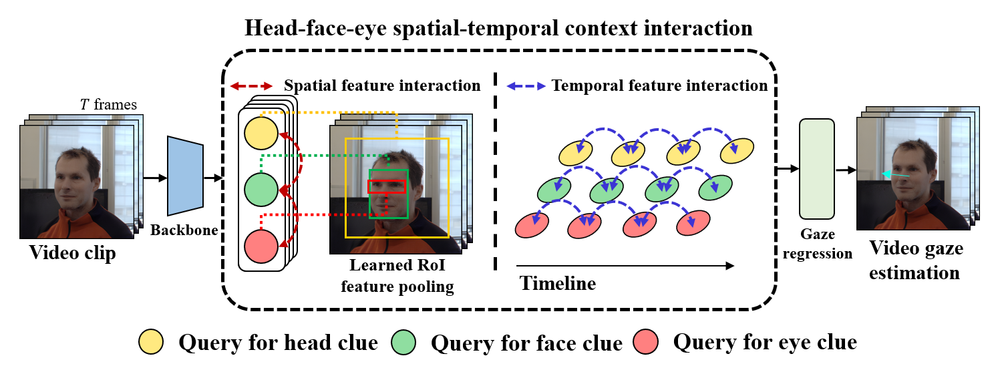

# End-to-end Video Gaze Estimation via Capturing Head-face-eye Spatial-temporal Interaction Context (aka. Multi Clue Gaze)
<div align="center">

Yiran Guan, Zhuoguang Chen, Wenzheng Zeng, Zhiguo Cao and Yang Xiao

Huazhong University of Science and Technology 

</div>

<div align="center">

English| [简体中文](/README_zh-CN.md) 

</div>

## Introduction
This repository contains the official implementation of the paper "End-to-end Video Gaze Estimation via Capturing Head-face-eye Spatial-temporal Interaction Context".

<div align="center">



</div>

We propose to facilitate video gaze estimation via capturing spatial-temporal interaction context among head, face, and eye in an end-to-end learning way, which has not been well concerned yet. Experiments on the challenging Gaze360 dataset verify the superiority of our proposition.
## Results and models
In our work, we test our model in two different dataset setting(Gaze360-setting and [l2CS-setting](https://github.com/Ahmednull/L2CS-Net)(i.e., only consider face detectable samples)) for fair comparision with previous method.

You can dowload the checkpoint for the model from the link inside the table.
| Setting                     | Backbone | MAE-Front180                                   | Checkpoint |
| ------------------------ | ------- | ------------------------------------ | ---------------------- |
| Gaze360-setting   | R-50    |  10.74            |           [url]        |
| l2cs-setting      | R-50    | 9.81        |        [url]    |               
## Get Started
### Prepare your python environment
1. Create a new conda environment:

   ```bash
   conda create -n MCgaze python=3.9
   conda activate MCgaze
   ```
   
2. Install Pytorch (1.7.1 is recommended), scipy, tqdm, pandas.

3. Install MMDetection. 

   * Install [MMCV](https://mmcv.readthedocs.io/en/latest/get_started/installation.html) first. 1.4.8 is recommended.

   * ```bash
     cd MCgaze
     pip install -v -e .
     ```
### Prepare your dataset
1. Download Gaze360 dataset from [official](http://gaze360.csail.mit.edu/).
2. Using our code to reorganized the img. You shoud modify the path first, and indicate the 'dataset_setting' value (i.e., 'L2CS' or 'Full').
   * ```bash
     python tools/gaze360_img_reorganize.py
     ```
3. Download the COCO format annotation from this [link].
### Inference & Evaluation

* Run the commands below for inference and evaluation in different settings. Remember to change the dataset path into yours.

##### Gaze360-setting

  ```bash
  bash tools/test_gaze360.sh
  ```

##### l2cs-setting

  ```bash
  bash tools/test_l2cs.sh
  ```


### Training

* Run the commands below to begin training in different settings.
##### Gaze360-setting

  ```bash
  bash tools/train_gaze360.sh
  ```

##### l2cs-setting

  ```bash
  bash tools/train_l2cs.sh
  ```

## Acknowledgement

This code is inspired by [MPEblink](https://github.com/wenzhengzeng/MPEblink), [TeViT](https://github.com/hustvl/TeViT) and [MMDetection](https://github.com/open-mmlab/mmdetection). Thanks for their great contributions on the computer vision community.

## Citation
