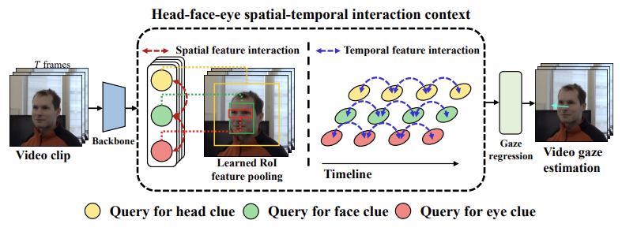

# End-to-end Video Gaze Estimation via Capturing Head-face-eye Spatial-temporal Interaction Context (aka. Multi Clue Gaze) [](https://paperswithcode.com/sota/gaze-estimation-on-gaze360?p=end-to-end-video-gaze-estimation-via)
<div align="center">

Yiran Guan\*, Zhuoguang Chen\*, [Wenzheng Zeng](https://wenzhengzeng.github.io/)<sup>†</sup>, [Zhiguo Cao](https://scholar.google.com/citations?user=396o2BAAAAAJ), [Yang Xiao](https://scholar.google.com/citations?user=NeKBuXEAAAAJ)<sup>†</sup>

Huazhong University of Science and Technology 

*: equal contribution, †: corresponding author


</div>

<div align="center">


English | [简体中文](/README_zh-CN.md) 

  [IEEE SPL](https://ieeexplore.ieee.org/document/10316587) | [arXiv](https://arxiv.org/abs/2310.18131) 

</div>

## 🥰Our work has been accepted by IEEE Signal Processing Letters！

## ✨Demo code has been added to this repo！
Inspired by [gaze360-demo](https://colab.research.google.com/drive/1SJbzd-gFTbiYjfZynIfrG044fWi6svbV?usp=sharing) and [yolov5-crowdhuman](https://github.com/deepakcrk/yolov5-crowdhuman). We use gaze estimation for each person in a video and visualize it. You can see `MCGaze_demo` for more details.

## Introduction

This repository contains the official implementation of the paper "End-to-end Video Gaze Estimation via Capturing Head-face-eye Spatial-temporal Interaction Context".

<div align="center">



</div>

We propose to facilitate video gaze estimation via capturing spatial-temporal interaction context among head, face, and eye in an end-to-end learning way, which has not been well concerned yet. Experiments on the challenging Gaze360 dataset verify the superiority of our proposition.
## Results and models
In our work, we test our model in two different dataset settings (Gaze360-setting and [l2CS-setting](https://github.com/Ahmednull/L2CS-Net)(i.e., only consider face detectable samples)) for fair comparison with the previous methods.

You can download the checkpoint for the model from the link inside the table.
| Setting                     | Backbone | MAE-Front180                      | Weight |  
| :------------------------: | :-------: | :------------------------------------: | :----------------------: |
| Gaze360-setting   | R-50    |  10.74            |           [Google Drive](https://drive.google.com/file/d/1ru0xhuB5N9kwvN9XLvZMQvVSfOgtbxmq/view?usp=drive_link)        |
| l2cs-setting      | R-50    | 9.81        |        [Google Drive](https://drive.google.com/file/d/1frp_rmER8_hf2xC0hbtjRTLA4TBqYePq/view?usp=drive_link)    |  

## Get Started
### Prepare your python environment
1. Create a new conda environment:

   ```bash
   conda create -n MCGaze python=3.9
   conda activate MCGaze
   ```
   
2. Install Pytorch (1.7.1 is recommended).
   ```bash
   pip install torch==1.7.1+cu110 torchvision==0.8.2+cu110 torchaudio==0.7.2 -f https://download.pytorch.org/whl/torch_stable.html
   ```

4. Install MMDetection. 

   * Install [MMCV-full](https://mmcv.readthedocs.io/en/latest/get_started/installation.html) first. 1.4.8 is recommended.
     ```bash
     pip install mmcv-full==1.4.8 -f https://download.openmmlab.com/mmcv/dist/cu110/torch1.7.1/index.html
     ```

   * ```bash
     cd MCGaze
     pip install -v -e .
     ```

   If you encounter difficulties during use, please open a new issue or contact us.
### Prepare your dataset
1. Download Gaze360 dataset from [official](http://gaze360.csail.mit.edu/).
2. Using our code to reorganize the file structure. You should modify the path first, and indicate the 'dataset_setting' value (i.e., 'L2CS' or 'Full').
   * ```bash
     python tools/gaze360_img_reorganize.py
     ```

3. Download the COCO format annotation from this [annotations](https://drive.google.com/drive/folders/1tNvXMn52bth8zSCGZK_syP6gdt7VLjGq?usp=drive_link), and put them into corresponding folders.

Here is the right hierarchy of folder `MCGaze/data` below:
 ```
  └── data
      |
      ├── gaze360
      |   ├── train_rawframes
      |   |   ├── 1
      |   |   |   ├── 00000.png
      |   |   |   ├── 00001.png
      |   |   |   └── ...
      |   |   ├── 2
      |   |   └── ...
      |   |     
      |   ├── test_rawframes
      |   |   ├── 1
      |   |   |   ├── 00000.png
      |   |   |   ├── 00001.png
      |   |   |   └── ...
      |   |    
      |   ├── train.json
      |   └── test.json
      |
      ├── l2cs
      |   ├── train_rawframes
      |   |   ├── 1
      |   |   |   ├── 00000.png
      |   |   |   └── ...
      |   |   ├── 2
      |   |   └── ...
      |   |     
      |   ├── test_rawframes
      |   ├── train.json
      |   └── test.json
      └──
  ``````
### Inference & Evaluation

* Run the commands below for inference and evaluation in different settings. 

If you want to evaluate the model without training by yourself, you need to download our [checkpoints](https://drive.google.com/drive/folders/1OX_nuxXYTH5i8E11UCyEcAsp6ExHDMra?usp=sharing) (we recommend that you can create a new folder "ckpts" and put the files in it). 

And remember to check if the file paths of shells are right.

##### Gaze360-setting

  ```bash
  bash tools/test_gaze360.sh
  ```

##### l2cs-setting

  ```bash
  bash tools/test_l2cs.sh
  ```


### Training

* Run the commands below to begin training in different settings.
##### Gaze360-setting

  ```bash
  bash tools/train_gaze360.sh
  ```

##### l2cs-setting

  ```bash
  bash tools/train_l2cs.sh
  ```

## Acknowledgement

This code is inspired by [MPEblink](https://github.com/wenzhengzeng/MPEblink), [TeViT](https://github.com/hustvl/TeViT) and [MMDetection](https://github.com/open-mmlab/mmdetection). Thanks for their great contributions to the computer vision community.

## Citation
If MCGaze is useful or relevant to your research, please kindly recognize our contributions by citing our paper:
```
@ARTICLE{10316587,
  author={Guan, Yiran and Chen, Zhuoguang and Zeng, Wenzheng and Cao, Zhiguo and Xiao, Yang},
  journal={IEEE Signal Processing Letters}, 
  title={End-to-end Video Gaze Estimation via Capturing Head-face-eye Spatial-temporal Interaction Context}, 
  year={2023},
  volume={},
  number={},
  pages={1-5},
  doi={10.1109/LSP.2023.3332569}}
```
